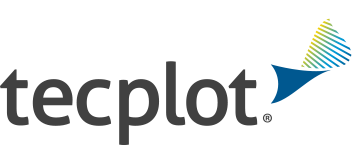
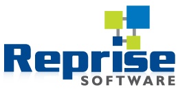

# Tecplot RLM Docker Container

| [](https://tecplot.com) | [](https://reprisesoftware.com) |
|---|---|

This repository provides a lightweight Docker installation for the Reprise License Manager (RLM) used by Tecplot 360 and related software. The resulting Docker image weighs in at just 69MB, and provides a simple way to run RLM on any Docker-capable machine with minimal overhead, and avoiding potential port conflicts with other services.

For more information about Tecplot RLM, see this [video tutorial and documentation](https://tecplot.com/2022/10/27/installing-a-network-license-using-rlm/).

## Installation

### 1. Download this repository

Clone this repository to your local machine:
```bash
git clone https://github.com/MolecularTheoryGroup/tecplot-rlm
```

Or download the zip archive for the latest release found under "Assets": https://github.com/MolecularTheoryGroup/tecplot-rlm/releases/latest

### 2. Acquiring the RLM Installation File

First, you'll need to acquire the RLM installation file from Tecplot:

- Log into (or create) your account at [my.tecplot.com](https://my.tecplot.com), and find the RLM installation file under *Product Releases -> RLM*. Accept license terms, download the file, and place it in the `build` directory.

You can then run this container either using Docker directly or using Docker Compose.

### 3. Configuration

#### Using Docker Compose (recommended)

1. Copy the provided `docker-compose.yml` file and modify the paths to match your system:
   - Update `/path/to/tecplot-rlm/build` to point to the `build` directory containing the Dockerfile and RLM installation file
   - Update `/path/to/tecplot-rlm/config` to point to your desired configuration directory
   - Optionally modify the port mappings if there are conflicts with existing services
   - Set your desired [timezone](https://en.wikipedia.org/wiki/List_of_tz_database_time_zones) for the `TZ` environment variable

2. Run the container:
```bash
docker-compose up -d
```

#### Using Docker directly

1. Build the image:
```bash
docker build -t tecplot-rlm /path/to/tecplot-rlm/build
```

- Replacing `/path/to/tecplot-rlm/build` with the actual path to the directory containing the Dockerfile and RLM installation file

1. Run the container:
```bash
docker run -d \
  --name tecplot-rlm \
  --hostname tecplot-rlm \
  --network bridge \
  --restart unless-stopped \
  -p 5053:5053 \
  -p 5054:5054 \
  -p 27100:27100 \
  -p 27101:27101 \
  -v /path/to/tecplot-rlm/config:/etc/rlm \
  -e TZ=America/Denver \
  tecplot-rlm
```

- Replacing `/path/to/tecplot-rlm/config` with the actual path to your desired configuration directory
- Optionally modify the port mappings if there are conflicts with existing services
- Set your desired [timezone](https://en.wikipedia.org/wiki/List_of_tz_database_time_zones) for the `TZ` environment variables

## Usage

### Initial Setup (generating host information and getting a license)

1. You need to generate "host IDs" for the container in order to receive a Tecplot license specific to your RLM Docker container. Start the container without a license file using `docker-compose up -d` (or `docker run` as described above).
2. The container will create a `myhostids.txt` file in your config directory and then quit.
3. Send the `myhostids.txt` file to Tecplot support to obtain your license file.

### Running the License Server

1. Place the received license file (`tecplotlm.lic`) in your config directory.
2. Start the container once more using `docker-compose up -d` (or `docker run` as described above).
3. The RLM server will start and be accessible at the host machine's local IP address on port 5054 (or the specified host port mapped to container port 5054). For example, `http://localhost:5054`.

### Server Logs and Monitoring

- You can monitor the server logs and output by running `docker logs --follow tecplot-rlm`. This will show both the RLM server output and the contents of all log files in real-time.
- Additionally, each time the container quits, it will copy all log files to your config directory for easy access.

## Documentation

The container automatically copies several documentation files to your config directory for easy access:
- PDF documentation files
- HTML documentation files
- `README.pw` file

These files are copied from the RLM installation and provide detailed information about the license server configuration and operation. You can find these files in your config directory after the first run of the container.

## Customization

### Option Files

The RLM server uses option `.opt` files to control its behavior. These files will be automatically copied to your config directory where you can modify them. The container monitors these files for changes, and the RLM server will automatically restart when modifications are detected.

### License File Updates

The container monitors the license file (`tecplotlm.lic`) for changes. If you update the license file, the container will automatically execute a `reread` command to apply the new license without requiring a restart.

## Ports

- 5053: Reserved
- 5054: RLM web interface
- 27100: Primary RLM license server port
- 27101: Additional license server port (more can be added as needed)

## Notes

- The container uses a dedicated `rlm` user for security
- All configuration files and logs are stored in the mounted config directory
- The container will quit if the RLM service stops
- A new `myhostids.txt` file will be generated each time the container starts, even if a license file is present. The old file will be saved as `myhostids.bak.txt`.
